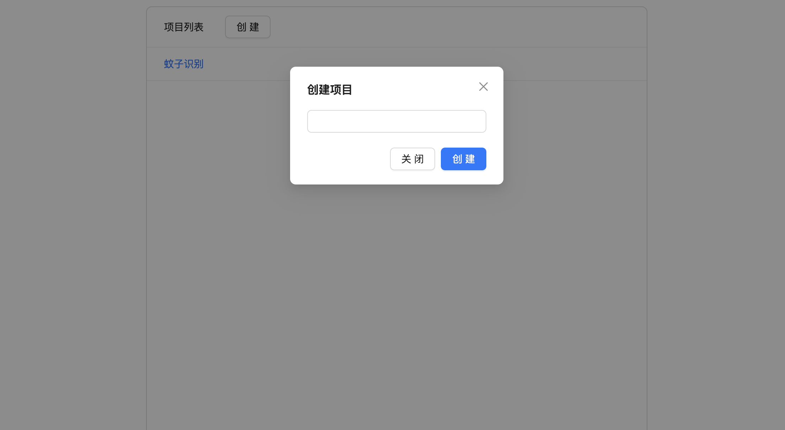

# yolo-label
> python的labelme太卡,而且macOS和Windows系统的功能界面不一样,很烦人.

## 使用方式
### 接口部分
> 进入目录: `cd api`

- 安装: `bun install`
- 启动: `bun start`

### 网页界面部分(修改源码)
> 进入目录: `cd ui`

- 安装: `bun install`
- 启动: `bun run dev`

> 访问 [http://127.0.0.1:3000](http://127.0.0.1:3000)

### 界面预览

  
  

## 功能列表
- 项目
  - [x] 创建项目
  - [x] 添加分类
  - [x] 删除分类
  - [x] 批量上传图片
  - [x] 删除图片
  - [ ] 一键划分数据集(ai-mosquito的script/assign-db.ts)
- 图片
  - [x] 添加多个标注
  - [x] 调整标注框
  - [x] 设置创建标注的默认分类
  - [ ] 修改标注分类
- 快捷键
  - [x] Q 删除当前选中的标注
  - [x] A 切换到上一张图片
  - [x] D 切换到下一张图片
  - [x] W 开启或关闭全局辅助线功能
  - [x] 左键选中标注
  - [x] 移动选中的标注或图片
  - [x] 右键创建标注(按下并拖动最后松开)

## 打包为单应用文件
- `cd api && bun build --compile ./server.ts --outfile yolo-label-app`
